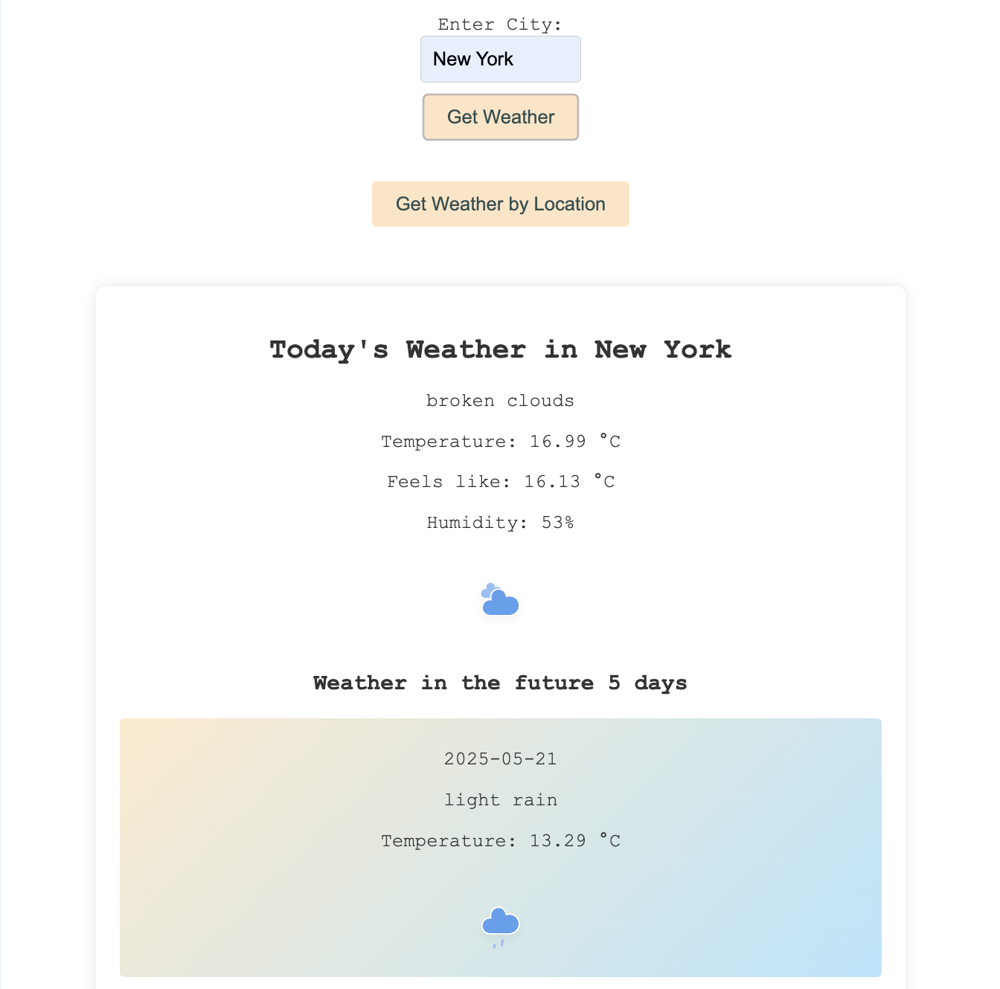

# Weather App

A simple weather application built using Flask. The app allows users to get the current weather and a 5-day weather forecast for a specified city or based on their current location.

## Features
- **Current Weather**: Users can enter a city name to get the current weather information, including temperature, humidity, and general weather description.
- **5-Day Forecast**: The application also provides a 5-day weather forecast for the selected city, showing the daytime weather for each day.
- **Weather by Location**: Users can use their device's geolocation to get the current weather and a 5-day forecast for their current location.



## Technologies
- **Flask**: Used to create the web application and handle routes.
- **HTML/CSS**: For creating a simple user interface.
- **OpenWeatherMap API**: Used to fetch the weather data.
- **JavaScript**: Used for handling form submissions and geolocation requests.

## Setup Instructions
1. **Clone the Repository**:
   ```sh
   git clone https://github.com/Sallyliubj/weather-app.git
   cd weather-app
   ```

2. **Create a Virtual Environment**:
   ```sh
   python -m venv venv
   source venv/bin/activate  # On Windows, use `venv\Scripts\activate`
   ```

3. **Install Dependencies**:
   ```sh
   pip install -r requirements.txt
   ```

4. **Run the Application**:
   ```sh
   python weather_app.py
   ```
   - The app will be accessible at `http://127.0.0.1:5000/`.

## How It Works
- Users can enter a city name or use their location to get the weather information.
- The app calls the OpenWeatherMap API to retrieve current weather data and a 5-day forecast.
- The UI displays the weather information, including temperature, feels like temperature, humidity, and a weather icon.

## Files Included
- **`weather_app.py`**: The main Flask application file.
- **`templates/index.html` and `templates/weather.html`**: HTML templates for the homepage and weather results.
- **`static/`**: Directory containing CSS and JavaScript files for styling and client-side functionality.
- **`requirements.txt`**: File listing all the Python dependencies required for the app.

## Notes
- Get your own API key from [OpenWeatherMap](https://openweathermap.org/api).
- The app is designed to be a simple implementation, and the UI can be further enhanced as needed.
